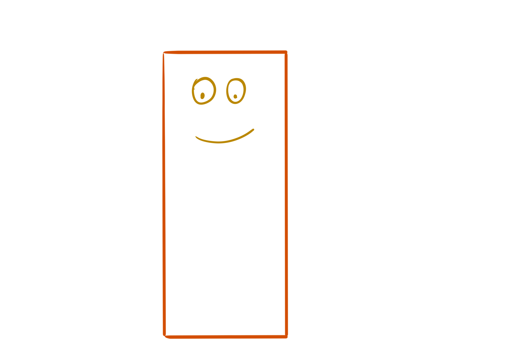
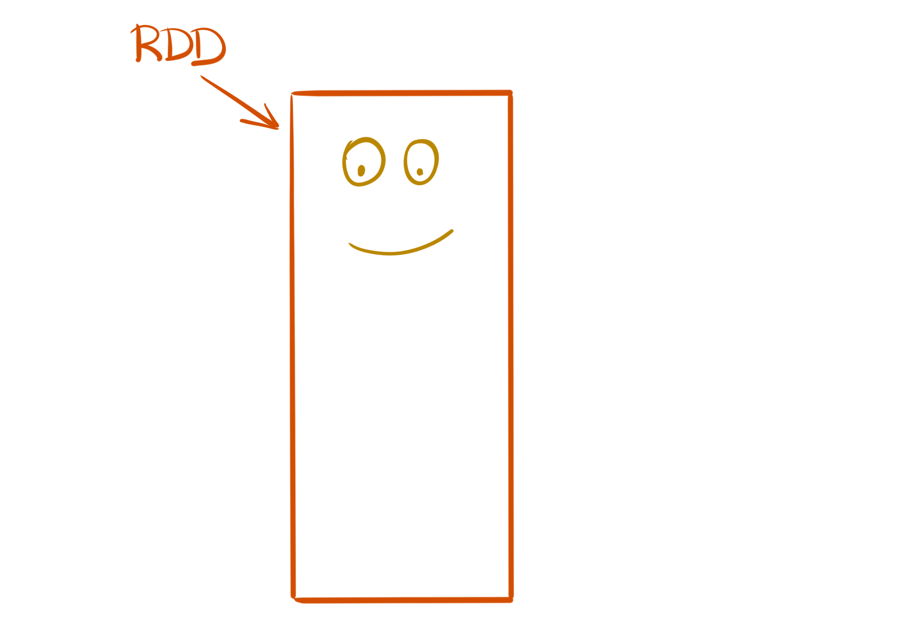
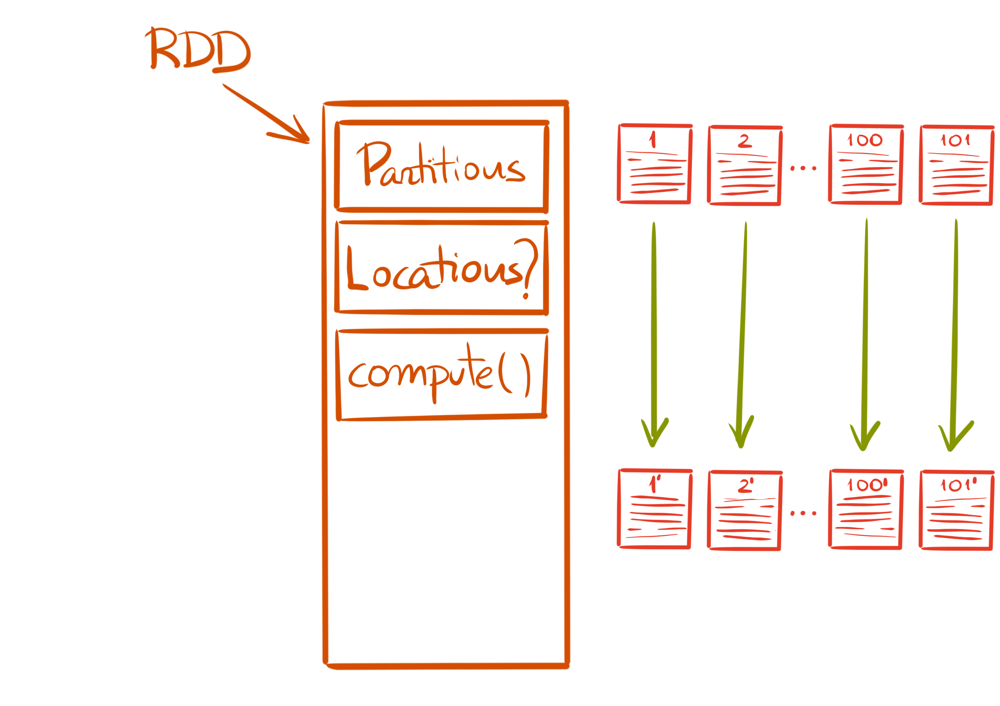
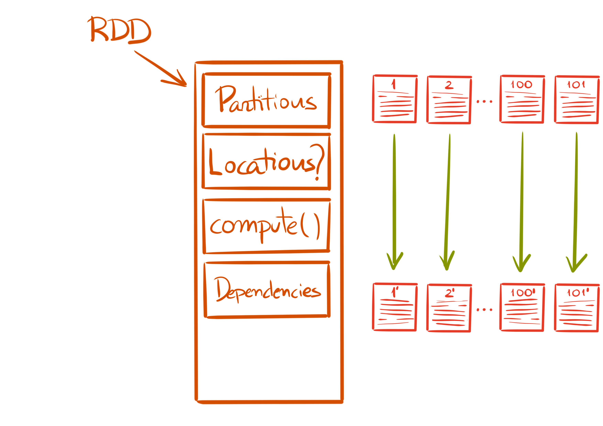

footer: 

# The Magic of **Py**Spark

### _An introduction to PySpark_

^ I will explain a bit what is `Spark` and how it works and then how `PySpark`
works. Then, workshop time

---

^ Test footnote, hello there

---

# whoami

- Ruben Berenguel (@berenguel)
- PhD in Mathematics
- (big) data consultant
- Lead data engineer using **Python**, **Go** and **Scala**
- Right now at **Affectv**: we are hiring in **Barcelona**

---

# What is __Spark__?

[.build-lists: true]

- Distributed Computation _framework_
- Open source
- Easy to use
- Scales horizontally *and* vertically

---

# How does __Spark work__?

---

# Spark usually runs on top of a __cluster manager__

^ This can be standalone, YARN, Mesos or in the bleeding edge, Kubernetes (using the Kubernetes scheduler)

---

# And a __distributed storage__

---

[.hide-footer]

## A Spark program runs in the __driver__

---

## The __driver__ requests resources from the __cluster manager__ to run tasks

^ We usually don't need to worry about what the executors do (unless they blow up)

---

## The __driver__ requests resources from the __cluster manager__ to run tasks

---

## The __driver__ requests resources from the __cluster manager__ to run tasks

---

## The __driver__ requests resources from the __cluster manager__ to run tasks

^ This is very nice, but what is the magic that lets us compute things on
several machines, and is machine-failure safe?

---

## The main building block is the __RDD__: 

##__R__esilient __D__istributed __D__ataset

^ RDDs are defined in the Scala core. In Python and R we end up interacting with the underlying JVM objects

---

^ Happy RDD

---

^ Happy RDD. A RDD needs 5 items to be considered complete (2 of them optional)

---

^ Partitions define how the data is _partitioned_ across machines

---

---

^ Locations (`preferredLocations`) are optional, and allow for fine grained
execution to avoid shuffling data across the cluster

---

---

^ Compute is evaluated in the executors, each executor has access to its
assigned partitions. The result of compute is a new RDD, with different data

---

---

^ Dependencies are also called _lineage_. Each __RDD__ (and by extension, each
partition) has a specific way to be computed. If for some reason one is lost
(say, a machine dies), __Spark__ knows how to recompute _only_ that

---

---

^ The partitioner needs to be a 1-1 function from keys/whatever to the data, to
allow recomputing. It is as well optional (Spark will default to something
sensible then)

--- 

### Two kind of operations:

## __Transformations__
## &
## __Actions__

---

__Transformations__: Reshape the data. They are part of __stages__

* Filter
* Map
* Join

^ The split between stage and stage happens when we _shuffle_ data. Shuffling is the move of data from executor to executor, required by many operations. If we could avoid shuffling, distributed computing would be easier

---

__Actions__: Return a result. They define __jobs__

* Count
* Show
* Write

^ Actions create a barrier between stages

---

---

# Py__Spark__

^ I will use PySpark to refer to the Python API on top of Spark, and say Scala
Spark or just Spark for the Scala API

---

## __PySpark__ offers a _Python_ API to the _Scala_ core of __Spark__

---

# It uses the __Py4J__ bridge

^ Each object in PySpark comes bundled with a JVM gateway (started when the
Python driver starts). Python methods then act on the internal JVM object by
passing serialised messages to the Py4J gateway

---

---

[.build-lists: true]

Workers act as __standalone processors__ of __streams of data__

* Connects back to the __JVM__ that started it
* Load included __Python__ libraries
* __Deserializes__ the pickled function coming from the stream
* Applies the __function__ to the data coming from the stream
* Sends the __output__ back

---

# What about **DataFrames**?

^ Isn't Spark supposed to be pretty magic and plan and optimise stuff?

---

## The **RDD** API expects you to handle everything. 

### But __Spark__ can magically optimise everything..

---

# ..if you use __Spark__ `DataFrame`

^ You can think of `DataFrame`s as RDDs which actually refer to tables. They
have column names, and may have types for each column

---

[.hide-footer]

## Spark will generate a __plan__
### (a __D__irected __A__cyclic __G__raph) 
## to compute the result

^ When you operate on DataFrames, plans are created magically. And actually it
will generate a logical plan, an optimised logical plan, an execution plan…

---

## And the plan will be optimised using __Catalyst__

^ The Catalyst optimiser. There's also a code generator in there (using Janino
to compile Java code in real time, how that works and why is a matter for
another presentation…) Catalyst prunes trees

---

## Please, please, use **Spark ≥ 2.3** (or, the latest you can)

---

## You should try to use `DataFrame` **unless there is a reason not to** (like some MLLib method)

---

### You should also enable *Arrow optimisations* to speed up the data transfer from the JVM to Python

#### **We'll see why and how later during the workshop**

---

### New project: **Koalas**[^1]

[^1]: https://github.com/databricks/koalas

#### Offers a unified API between Pandas and Spark Dataframes (as much as possible)

^ The project is [here](https://github.com/databricks/koalas)

---

### Pure Python alternative: **Dask**[^1]

#### Another distributed framework

[^1]: https://github.com/dask/dask

^ The project is [here](https://github.com/dask/dask)

---

## Should you use **Spark**?

---

# Yes *if*

[.build-lists: true]

- The data is **very** large (significantly larger than memory)
- Your org already has Spark cluster or codebase
- There is no better alternative

---

# No *if*

[.build-lists: true]

- You want to add **Spark** to your CV
- Java stacktraces scare you

---

# __Resources__

* [Spark documentation](https://spark.apache.org/docs/latest/)
*  [High Performance Spark by Holden Karau](https://www.amazon.com/High-Performance-Spark-Practices-Optimizing/dp/1491943203/ref=sr_1_3?ie=UTF8&qid=1528135254&sr=8-3&keywords=holden+karau)
* [The Internals of Apache Spark 2.4.2 by Jacek Laskowski](https://jaceklaskowski.gitbooks.io/mastering-apache-spark/)
* [Spark's Github](https://github.com/apache/spark)
* [Become a contributor](https://spark.apache.org/contributing.html)

---

# __Thanks!__

---

# Workshop time!

---

Get the slides and notebook we will use from my github:

`github.com/rberenguel/`

The repository is 

`pyspark_workshop`

---

# Further references

---

[.autoscale: true]

## __Arrow__
[Arrow's __home__](https://arrow.apache.org)
[Arrow's __github__](https://github.com/apache/arrow)
[Arrow speed __benchmarks__](https://gist.github.com/wesm/0cb5531b1c2e346a0007)
[Arrow to Pandas conversion __benchmarks__](http://wesmckinney.com/blog/high-perf-arrow-to-pandas/)
[__Post__: Streaming columnar data with Apache Arrow](http://wesmckinney.com/blog/arrow-streaming-columnar/)
[__Post__: Why Pandas users should be excited by Apache Arrow](http://wesmckinney.com/blog/pandas-and-apache-arrow/)
[__Code__: Arrow-Pandas compatibility layer code](https://github.com/apache/arrow/blob/master/python/pyarrow/pandas_compat.py)
[__Code__: Arrow Table code](https://github.com/apache/arrow/blob/master/python/pyarrow/table.pxi)
[PyArrow in-memory __data model__](https://arrow.apache.org/docs/python/data.html)
[Ballista:  a __POC__ distributed compute platform (Rust)](https://github.com/andygrove/ballista)
[PyJava: __POC__ on Java/Scala and Python data interchange with Arrow](https://github.com/allwefantasy/pyjava)

---

[.autoscale: true]

## __Pandas__
[Pandas' __home__](http://pandas.pydata.org)
[Pandas' __github__](https://github.com/pandas-dev/pandas)
[__Guide__: Idiomatic Pandas](https://tomaugspurger.github.io/modern-1-intro.html)
[__Code__: Pandas internals](https://github.com/pandas-dev/pandas/blob/master/pandas/core/internals.py)
[__Design__: Pandas internals ](https://github.com/pydata/pandas-design/blob/master/source/internal-architecture.rst)
[__Talk__: Demystifying Pandas' internals, by Marc Garcia](https://www.youtube.com/watch?v=F37fV0uFf60)
[Memory Layout of Multidimensional Arrays in __numpy__](https://eli.thegreenplace.net/2015/memory-layout-of-multi-dimensional-arrays/)

---

[.autoscale: true]

## __Spark/PySpark__

[__Code__: PySpark serializers](https://github.com/apache/spark/blob/master/python/pyspark/serializers.py)
[__JIRA__: First steps to using Arrow (only in the PySpark driver)](https://issues.apache.org/jira/browse/SPARK-13534)
[__Post__: Speeding up PySpark with Apache Arrow](https://arrow.apache.org/blog/2017/07/26/spark-arrow/)
[Original __JIRA__ issue: Vectorized UDFs in Spark](https://issues.apache.org/jira/browse/SPARK-21190)
[Initial __doc__ draft](https://github.com/icexelloss/spark/blob/pandas-udf-doc/docs/pyspark-pandas-udf.md#definition-of-pandas-udf)
[__Post__ by Bryan Cutler (leader for the Vec UDFs PR)](https://bryancutler.github.io/vectorizedUDFs/)
[__Post__: Introducing Pandas UDF for PySpark](https://databricks.com/blog/2017/10/30/introducing-vectorized-udfs-for-pyspark.html)
[__Code__: org.apache.spark.sql.vectorized](https://github.com/apache/spark/tree/dd8e257d1ccf20f4383dd7f30d634010b176f0d3/sql/core/src/main/java/org/apache/spark/sql/vectorized)
[__Post__ by Bryan Cutler: Spark toPandas() with Arrow, a Detailed Look](https://bryancutler.github.io/toPandas/)

---

[.autoscale: true]

## __Py4J__

[Py4J's __home__](https://www.py4j.org)
[Py4J's __github__](https://github.com/bartdag/py4j)
[__Code__: Reflection engine](https://github.com/bartdag/py4j/blob/master/py4j-java/src/main/java/py4j/reflection/ReflectionEngine.java)

---

# `EOF`
